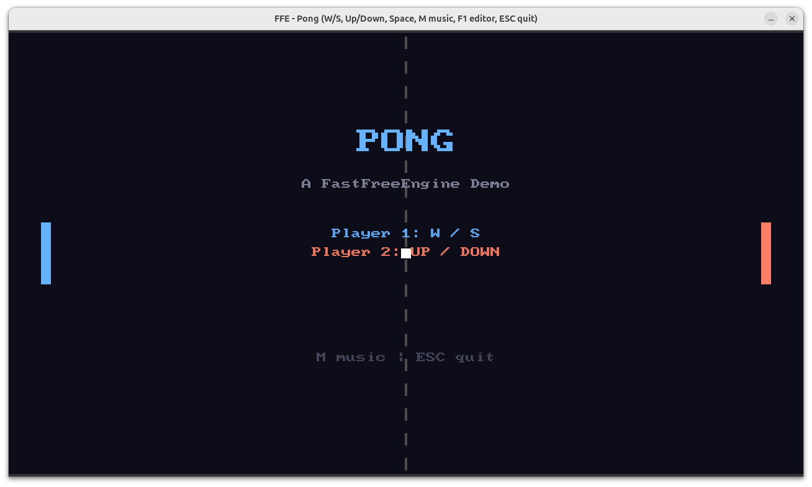
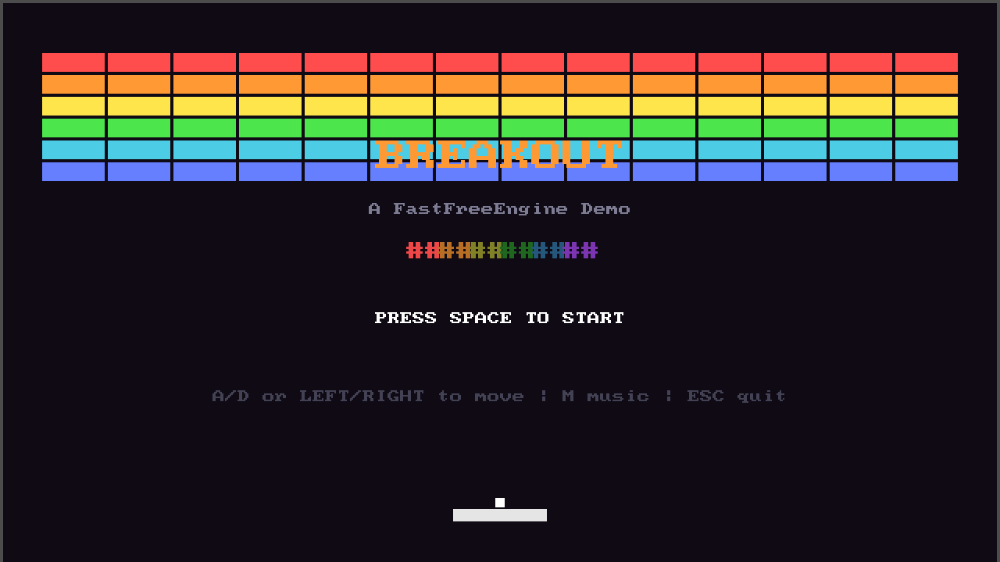
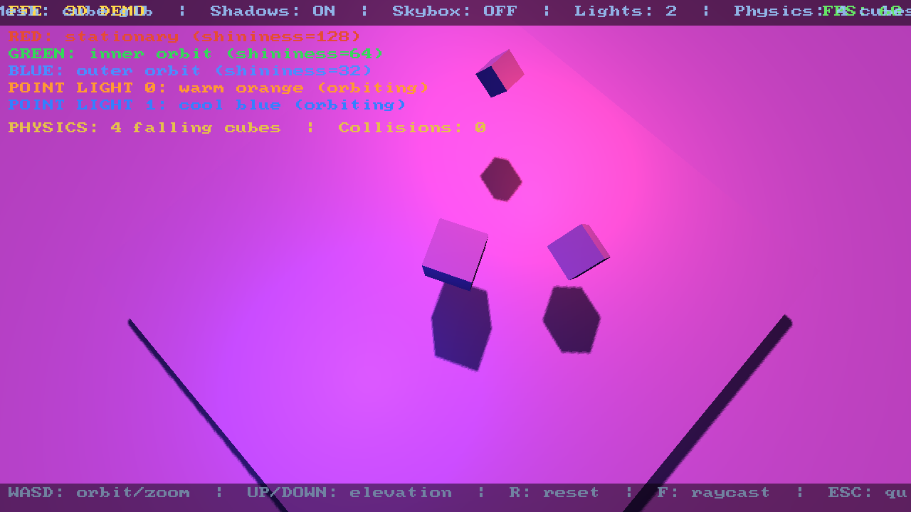

# FastFreeEngine

**A performance-first, open-source C++ game engine that runs on old hardware.**

[](LICENSE)

1005 tests | Zero warnings | Clang-18 + GCC-13 | ~169 Lua bindings | 6 demo games

---

## What is FFE?

FastFreeEngine is a complete game development platform -- engine, editor, networking, and learning resources -- built so that anyone can make games, regardless of their hardware budget.

A student with a ten-year-old laptop should be able to build a game that runs beautifully and share it with the world. A kid who discovers FFE because they want to make games should come out the other side understanding systems programming, graphics, and architecture -- because the engine was designed to be learned from, not just used.

FFE targets indie developers, students, hobbyists, and anyone working with older or lower-end hardware. The engine guarantees 60 fps on its declared minimum tier, or the feature does not ship. Every performance decision is an accessibility decision.

The engine ships with **AI-native documentation**. Every subsystem includes a `.context.md` file written for LLMs to consume, so developers can use AI assistants to write correct game code against FFE immediately. Point your AI coding assistant at the project directory and it should generate idiomatic FFE code out of the box.

FFE is free and open source forever. MIT licensed. That is not up for debate.

---

## Showcase: "Echoes of the Ancients"

FFE's flagship demo is a **3-level 3D action-exploration game** showcasing the engine's full capabilities. Built entirely in Lua on top of the engine, it proves that FFE can ship real, playable games -- not just tech demos.

**3 Levels:**
- **The Courtyard** -- Outdoor ruins with push-block puzzles, guardian enemies, destructible walls, fog, directional shadows, and 4 point lights
- **The Temple** -- Underground temple with dark atmospheric lighting, lava pits, crystal sequence puzzles, timed disappearing bridges, and a boss guardian
- **The Summit** -- Floating islands above the clouds, dramatic sunset skybox, timed platforms, and a final boss encounter

**Game Features:**
- Real 3D models (.glb) from Khronos glTF samples (damaged helmet, animated characters, fox, duck, and more)
- Third-person orbit camera with physics-based movement and jumping
- Combat system with melee attacks, health, and damage
- Guardian enemies with patrol/chase AI state machines
- Push-block puzzles, crystal sequence puzzles, timed platforms, pressure plates, destructible walls
- Boss fights with increased HP and distinct behavior
- Atmospheric lighting: directional shadows, up to 4 point lights, linear fog
- Skybox environments, particle effects, and spatial audio
- Original music tracks per level
- Main menu with gamepad support and victory screen with completion stats
- Full Xbox controller and keyboard+mouse support
- HUD with health bar, artifact count, and interaction prompts

```bash
./build/examples/runtime/ffe_runtime examples/showcase/game.lua
```

The showcase exercises every major engine subsystem in a single cohesive experience and serves as a reference implementation for developers learning FFE.

---

## Quick Start: Your First Game in 15 Lines

Write game logic in Lua. The engine handles rendering, input, and audio:

```lua
-- my_game.lua
local player = ffe.createEntity()
ffe.addTransform(player, 0, 0, 0, 1, 1)
ffe.addSprite(player, ffe.loadTexture("textures/white.png"), 32, 32, 0.2, 0.8, 1.0, 1, 1)
ffe.addPreviousTransform(player)

function update(entityId, dt)
    local t = {}
    ffe.fillTransform(player, t)
    local speed = 200
    if ffe.isKeyHeld(ffe.KEY_W) then t.y = t.y + speed * dt end
    if ffe.isKeyHeld(ffe.KEY_S) then t.y = t.y - speed * dt end
    if ffe.isKeyHeld(ffe.KEY_A) then t.x = t.x - speed * dt end
    if ffe.isKeyHeld(ffe.KEY_D) then t.x = t.x + speed * dt end
    ffe.setTransform(player, t.x, t.y, 0, 1, 1)
    if ffe.isKeyPressed(ffe.KEY_ESCAPE) then ffe.requestShutdown() end
end
```

See the [full tutorial](docs/tutorial.md) for audio, collisions, sprites, and more.

---

## Features

All subsystems below are implemented and working together in six demo games including the 3D showcase "Echoes of the Ancients".

### Core Engine

- **ECS** -- Entity Component System built on EnTT with a thin `World` wrapper and function-pointer system dispatch. No virtual calls in hot paths.
- **Lua Scripting** -- Sandboxed LuaJIT with instruction budget (1M ops), blocked globals, and ~169 `ffe.*` API bindings across all subsystems.
- **Arena Allocator** -- Linear bump allocator with cache-line alignment and per-frame reset. Zero heap allocations in hot paths.
- **Input System** -- State-based keyboard, mouse, and gamepad input (pressed/held/released) with action mapping (64 actions, 4 bindings each). Up to 4 controllers. Xbox controller supported.
- **Timers** -- `ffe.after()` and `ffe.every()` with cancel support. 256 max concurrent timers, fixed-size array.
- **Save/Load** -- JSON-based game state persistence with security hardening (path traversal prevention, size limits, atomic writes).
- **Scene Management** -- `destroyAllEntities`, `cancelAllTimers`, `loadScene` for clean scene transitions.
- **Logging** -- printf-style logging with compile-time macro filtering and minimal lock scope.

### 2D Rendering

- **Sprite Rendering** -- OpenGL 3.3 backend with batched draw calls (2048 sprites per batch), packed 64-bit sort keys, and render queue.
- **Sprite Animation** -- Grid-based atlas animation with configurable frame count, columns, frame duration, and looping.
- **Tilemap** -- Tilemap component with `setTile`/`getTile`, supporting maps up to 1024x1024.
- **Particle System** -- ParticleEmitter with 128 inline particle pool, gravity, color interpolation, and size interpolation.
- **Bitmap Text** -- Built-in 8x8 pixel font with `ffe.drawText()`. No external font files needed.
- **TTF Fonts** -- stb_truetype-based TrueType font loading with atlas generation. Up to 8 fonts simultaneously.
- **Texture Loading** -- stb_image-based loader with path traversal prevention, write-once asset root, and configurable filter/wrap modes (LINEAR or NEAREST for pixel art).
- **2D Collision** -- Spatial hash broadphase with AABB and circle colliders, layer/mask filtering, and Lua collision callbacks.

### 3D Rendering

- **Mesh Rendering** -- glTF (.glb) mesh loading via cgltf. Blinn-Phong lighting with directional and point lights (up to 4).
- **Materials** -- Diffuse, specular, and normal map support with configurable shininess.
- **Shadow Mapping** -- Depth FBO with PCF 3x3 filtering. Configurable bias and shadow area.
- **Skybox** -- Cubemap environment rendering (6-face loading).
- **Linear Fog** -- Distance-based fog with configurable color, near, and far distances.
- **Skeletal Animation** -- Bone hierarchy with GPU skinning (64 max bones). Play/stop/speed control from Lua.
- **3D Camera** -- FPS (yaw/pitch) and orbit (target/radius) camera modes with Lua bindings.

### 3D Physics

- **Jolt Physics Integration** -- Rigid bodies, collision callbacks, and raycasting with entity-body mapping. 13 Lua bindings.

### Audio

- **Sound Playback** -- WAV, OGG, and MP3 support via miniaudio. One-shot SFX and streaming background music with volume control.
- **3D Positional Audio** -- Spatial voices with listener sync (`playSound3D`).
- **Headless Mode** -- Audio subsystem works in headless mode for CI and testing.

### Standalone Editor

A graphical application for building games with FFE, similar to Unity or Unreal Editor:

- **Scene Hierarchy** -- Tree view with parent/child relationships and drag reorder.
- **Entity Inspector** -- Create, modify, and delete entities and components with full undo/redo.
- **Undo/Redo** -- Comprehensive command system covering entity, component, inspector fields, add/remove, and reparent operations.
- **Scene View** -- 2D and 3D viewport with FBO rendering.
- **Play-in-Editor** -- Snapshot/restore with Play/Pause/Resume/Stop controls.
- **Viewport Gizmos** -- Translate, rotate, and scale with axis constraints and undo integration.
- **Asset Browser** -- Directory traversal, file type indicators, and drag-and-drop to inspector for texture/mesh assignment.
- **Scene Serialisation** -- Save/load scene files (JSON) with entity count limits and NaN rejection.
- **Build Pipeline** -- Export games with runtime binary and `ffe.loadSceneJSON` for standalone distribution.
- **Keyboard Shortcuts** -- ShortcutManager with 7 default bindings (Ctrl+Z, Ctrl+S, etc.).
- **File Dialogs** -- Open/Save Scene dialogs with security boundary enforcement.

### Multiplayer Networking

Built-in client-server multiplayer for both 2D and 3D games:

- **Network Transport** -- ENet wrapper with ServerTransport/ClientTransport and function-pointer callbacks.
- **Packet System** -- PacketReader/Writer with bounds checking, NaN/Inf rejection, and 1200-byte MTU limit.
- **Client-Server Architecture** -- Authoritative server with snapshot broadcast and client interpolation.
- **ECS State Replication** -- ReplicationRegistry supporting 32 component types with snapshot serialization and slerp interpolation.
- **Client-Side Prediction** -- 64-slot ring buffer with configurable reconciliation threshold.
- **Server Reconciliation** -- Server input processing with per-connection queue and validation.
- **Lobby/Matchmaking** -- Create, join, leave, ready, and start game with max player enforcement and duplicate rejection.
- **Lag Compensation** -- 64-frame history with ray-vs-sphere hit check and server-side rewind window.
- **Network Security** -- Packet validation, per-connection rate limiting (100 pkt/s, 64KB/s).
- **30 Lua Bindings** -- Full networking API accessible from game scripts.

### Scene Graph

- **Parent/Child Relationships** -- `setParent`, `removeParent`, `getChildren`, `isAncestor` with circular parenting prevention.
- **Root Entity Queries** -- `isRoot`, `getRootEntities` for hierarchy traversal.

### Utilities

- **Screenshot** -- In-engine screenshot capture to PNG via `ffe.screenshot()`.
- **Camera Shake** -- `ffe.cameraShake()` for screen effects.
- **Clear Color** -- `ffe.setBackgroundColor()` for viewport background.

---

## Hardware Tiers

Every FFE system declares which hardware tiers it supports. No feature may silently degrade performance on a lower tier.

| Tier | Era | GPU API | Min VRAM | Threading | Default |
|------|-----|---------|----------|-----------|---------|
| **RETRO** | ~2005 | OpenGL 2.1 | 512 MB | Single-core safe | No |
| **LEGACY** | ~2012 | OpenGL 3.3 | 1 GB | Single-core safe | **Yes** |
| **STANDARD** | ~2016 | OpenGL 4.5 / Vulkan | 2 GB | Multi-threaded | No |
| **MODERN** | ~2022 | Vulkan | 4 GB+ | Multi-threaded | No |

**LEGACY is the default tier.** If you are unsure which to pick, use LEGACY. It targets hardware from around 2012 -- most laptops and desktops from the last decade will run it comfortably.

---

## Building from Source

### Prerequisites

**Linux (Ubuntu 22.04+)** is the primary development platform. Windows (MinGW cross-compile) and macOS (arm64) are also supported.

Install the required packages on Linux:

```bash
sudo apt-get install \
    build-essential gcc-13 g++-13 \
    clang-18 clangd-18 clang-tidy-18 clang-format-18 \
    cmake ninja-build \
    mold ccache \
    libgl1-mesa-dev libvulkan-dev \
    libglfw3-dev libasound2-dev libpulse-dev \
    luajit libluajit-5.1-dev \
    pkg-config curl unzip \
    sox  # optional -- used to generate audio test assets
```

### vcpkg Setup

FFE uses [vcpkg](https://github.com/microsoft/vcpkg) for C++ dependency management:

```bash
cd ~
git clone https://github.com/microsoft/vcpkg.git
./vcpkg/bootstrap-vcpkg.sh
```

Add to your `~/.bashrc` (or equivalent):

```bash
export VCPKG_ROOT="$HOME/vcpkg"
export PATH="$VCPKG_ROOT:$PATH"
```

Then reload: `source ~/.bashrc`

### Configure and Build

**Build with Clang-18 (primary compiler):**

```bash
git clone https://github.com/user/FastFreeEngine.git
cd FastFreeEngine

cmake -B build -G Ninja \
    -DCMAKE_CXX_COMPILER=clang++-18 \
    -DCMAKE_BUILD_TYPE=Debug \
    -DFFE_TIER=LEGACY

cmake --build build
```

**Build with GCC-13 (secondary compiler):**

```bash
cmake -B build-gcc -G Ninja \
    -DCMAKE_CXX_COMPILER=g++-13 \
    -DCMAKE_BUILD_TYPE=Debug

cmake --build build-gcc
```

**Windows (MinGW cross-compile from Linux):**

```bash
cmake -B build-mingw -G Ninja \
    -DCMAKE_TOOLCHAIN_FILE=cmake/toolchains/mingw-w64-x86_64.cmake \
    -DCMAKE_BUILD_TYPE=Debug \
    -DFFE_TIER=LEGACY

cmake --build build-mingw
```

### Running Tests

1005 Catch2 tests covering core, renderer (2D and 3D), scripting, audio, physics, networking, and more:

```bash
ctest --test-dir build --output-on-failure --parallel $(nproc)
```

### Selecting a Hardware Tier

Pass `-DFFE_TIER=<TIER>` during configuration. The default is `LEGACY`.

```bash
cmake -B build -G Ninja -DCMAKE_CXX_COMPILER=clang++-18 -DFFE_TIER=RETRO
cmake -B build -G Ninja -DCMAKE_CXX_COMPILER=clang++-18 -DFFE_TIER=MODERN
```

---

## Running the Demos

### Echoes of the Ancients (Showcase)

The flagship 3-level 3D action-exploration game exercising every engine subsystem. Real CC0 3D models (Khronos glTF samples), atmospheric lighting, physics puzzles, combat, and original music.

```bash
./build/examples/runtime/ffe_runtime examples/showcase/game.lua
```

- **WASD** to move, **Space** to jump, **Mouse** to orbit camera
- **Left click** or **F** for melee attack, **E** for interaction
- **Xbox controller** fully supported (left stick move, A jump, X attack, Y interact)
- 3 levels: The Courtyard, The Temple, The Summit
- Collect artifacts, defeat guardians, solve puzzles
- Main menu, victory screen with completion stats

### Collect the Stars (lua_demo)

A complete 2D mini-game written entirely in Lua exercising every engine subsystem.

```bash
./build/examples/lua_demo/ffe_lua_demo
```

- **WASD** to move the player
- Collect animated spinning stars for points
- **F1** to toggle the editor overlay
- **ESC** to quit
- Background music and pickup sound effects

### Pong

Classic two-player Pong with visual effects -- ball trail, paddle flash on hit, speed color shift, goal flash panels, and background music.



```bash
./build/examples/pong/ffe_pong
```

- **W/S** left paddle, **UP/DOWN** right paddle
- **SPACE** to serve the ball
- First to 5 wins -- ball speeds up each rally
- **M** music toggle, **F1** editor, **ESC** to quit

### Breakout

Classic brick-breaking game with particle effects -- brick destruction particles, ball trail, speed-based color shifting, paddle flash, life indicators, and a victory particle burst.



```bash
./build/examples/breakout/ffe_breakout
```

- **A/D** or **LEFT/RIGHT** move paddle
- **SPACE** to launch ball, restart after game over
- 84 colorful bricks in 6 rows, ball speeds up per hit
- Particle effects on brick destruction, ball pulsing before launch
- 3 lives, **M** music toggle, **F1** editor, **ESC** quit

### 3D Demo

A 3D scene demonstrating mesh loading, Blinn-Phong lighting with directional and point lights, materials (specular/normal maps), shadow mapping, and skybox environment rendering.



```bash
./build/examples/3d_demo/ffe_3d_demo
```

- 3D mesh rendering with .glb models
- Directional light with PCF shadow mapping
- Two point lights (warm orange + cool blue)
- Orbit camera with mouse control

### Net Arena (Multiplayer)

A 2D multiplayer arena demonstrating client-side prediction, server reconciliation, and networked gameplay.

```bash
# Start the server
./build/examples/net_demo/ffe_net_demo --server

# Connect a client (in another terminal)
./build/examples/net_demo/ffe_net_demo --client
```

- Client-side prediction with server reconciliation
- Networked entity replication and interpolation

### Other Demos

```bash
# Bouncing sprites demo
./build/examples/hello_sprites/ffe_hello_sprites

# Interactive WASD movement demo
./build/examples/interactive_demo/ffe_interactive_demo

# Headless test (CI-safe, no display required)
./build/examples/headless_test/ffe_headless_test
```

---

## Project Structure

```
engine/
  core/         ECS, types, arena allocator, logging, input, timers, application loop
  renderer/     OpenGL 3.3 backend, sprite batching, textures, sprite animation,
                3D mesh, lighting, shadows, skybox, fog, skeletal animation, camera
  audio/        miniaudio integration, WAV/OGG/MP3, SFX + streaming music, 3D spatial audio
  physics/      2D collision (spatial hash, AABB/circle) + 3D physics (Jolt, rigid bodies, raycasting)
  scripting/    Lua sandbox, ~169 ffe.* API bindings, instruction budget
  networking/   ENet transport, replication, server/client, prediction, lobby, lag compensation
  editor/       Standalone editor application (ImGui, hierarchy, inspector, viewport, gizmos)

tests/          1005 Catch2 tests (core, renderer, scripting, audio, physics, networking)
examples/       Demo games (showcase, lua_demo, pong, breakout, 3d_demo, net_demo, hello_sprites, headless_test)
assets/
  textures/     PNG textures and spritesheets
  audio/        WAV sound effects, OGG/MP3 music tracks
  models/       CC0 glTF (.glb) 3D models
docs/
  architecture/ ADR design documents for each subsystem
  devlog.md     Session-by-session development history
website/        MkDocs documentation site (tutorials, deep dives, learning track)
cmake/
  toolchains/   MinGW cross-compile toolchain
.github/
  workflows/    CI: Linux Clang-18, Linux GCC-13
```

Every engine subdirectory contains a `.context.md` file with API documentation, usage patterns, and anti-patterns -- written for both humans and AI assistants.

---

## Documentation

FFE ships a documentation website built with MkDocs and the Material theme, including:

- **Getting Started** -- Install, build, and run your first game in 15 minutes
- **Tutorials** -- Step-by-step guides for your first 2D game, first 3D scene, and multiplayer basics
- **How It Works** -- Deep dives into ECS internals, renderer architecture, and networking
- **API Reference** -- Auto-generated from `.context.md` files across all subsystems
- **Build Your Own Engine** -- A learning track teaching engine development concepts (first installment: "Build an ECS from Scratch")
- **Community Showcase** -- All six official demo games with descriptions and screenshots

Build and serve the docs locally:

```bash
cd website
pip install mkdocs-material
mkdocs serve
```

---

## Dependencies

Managed via vcpkg (see `vcpkg.json`):

| Dependency | Purpose |
|------------|---------|
| [EnTT](https://github.com/skypjack/entt) | Entity Component System |
| [GLM](https://github.com/g-truc/glm) | Math library |
| [Dear ImGui](https://github.com/ocornut/imgui) | Editor UI (with GLFW + OpenGL3 bindings) |
| [sol2](https://github.com/ThePhD/sol2) | Lua C++ bindings |
| [Tracy](https://github.com/wolfpld/tracy) | Frame profiler |
| [Catch2](https://github.com/catchorg/Catch2) | Test framework |
| [nlohmann-json](https://github.com/nlohmann/json) | JSON parsing (scenes, save/load, networking) |
| [Jolt Physics](https://github.com/jrouwe/JoltPhysics) | 3D physics engine |
| [ENet](https://github.com/lsalzman/enet) | UDP networking (multiplayer transport) |

System packages:

| Dependency | Purpose |
|------------|---------|
| LuaJIT | Lua scripting runtime |
| GLFW | Window and input management |
| glad | OpenGL function loading (vendored in `third_party/`) |
| stb_image | Texture loading (vendored in `third_party/`) |
| stb_image_write | Screenshot PNG encoding (vendored in `third_party/`) |
| [stb_truetype](https://github.com/nothings/stb) | TTF font rendering (vendored in `third_party/`) |
| [cgltf](https://github.com/jkuhlmann/cgltf) | glTF mesh loading (vendored in `third_party/`) |
| miniaudio | Audio playback (vendored in `third_party/`) |

---

## Cross-Platform Support

| Platform | Compiler | Status |
|----------|----------|--------|
| Linux | Clang-18 | Primary -- full CI |
| Linux | GCC-13 | Secondary -- full CI |
| Windows | MinGW-w64 (cross-compile) | Builds from Linux |
| macOS | Apple Clang (arm64) | Disabled -- upstream LuaJIT vcpkg issue on arm64-osx |

---

## License

FastFreeEngine is licensed under the [MIT License](LICENSE). Free and open source, forever.

---

## Status

**Active development.** All six phases are complete. Phase 7 (Rendering Pipeline Modernization) is next.

| Phase | Status |
|-------|--------|
| Phase 1 -- 2D Foundation (Linux) | COMPLETE |
| Phase 2 -- 3D Foundation | COMPLETE |
| Phase 3 -- Standalone Editor | MVP COMPLETE |
| Phase 4 -- Networking / Multiplayer | COMPLETE |
| Phase 5 -- Website / Learning Platform | COMPLETE |
| Phase 6 -- Showcase Game ("Echoes of the Ancients") | COMPLETE |
| Phase 7 -- Rendering Pipeline Modernization | NEXT |

### Phase 7: Rendering Pipeline Modernization

The next phase focuses on bringing the renderer up to modern standards while maintaining LEGACY tier compatibility:

- **PBR Materials** -- Physically-based rendering with metallic-roughness workflow
- **Post-Processing Pipeline** -- Bloom, tone mapping (HDR), and configurable effect chain
- **GPU Instancing** -- Batched draw calls for repeated meshes (vegetation, props, crowds)
- **SSAO** -- Screen-space ambient occlusion for improved depth perception
- **Anti-Aliasing** -- MSAA and/or FXAA for clean edges on all tiers

### Planned Future Phases

FFE has an ambitious roadmap beyond Phase 7. Planned work includes:

- **Vulkan Renderer** -- A modern Vulkan backend alongside the existing OpenGL 3.3, enabling STANDARD and MODERN tier features (compute shaders, GPU-driven rendering, ray tracing on MODERN tier)
- **Terrain System** -- Heightmap-based terrain with LOD, texture splatting, and vegetation placement for open-world games
- **Advanced Editor** -- Project wizard, preferences persistence, visual scripting, LLM integration panel, prefab system
- **Cross-Platform Native Builds** -- Native Windows (MSVC), native macOS (Xcode), Linux packaging (AppImage/Flatpak)
- **Asset Pipeline** -- Texture compression, mesh optimization, asset bundling, hot-reload during development
- **Plugin/Extension System** -- C++ and Lua plugin API for community extensions, custom renderers, and tool integrations
- **AI Tooling** -- LLM integration panel in the editor, AI-assisted level design, code generation from natural language

1005 tests pass on both compilers with zero warnings. The engine supports full 2D and 3D game development with multiplayer networking, a standalone editor, 3D physics, skeletal animation, shadow mapping, and more -- demonstrated across six playable demos including the flagship "Echoes of the Ancients" showcase.

See `docs/devlog.md` for the full session-by-session development history.

**Getting started?** Read the [Quick-Start Tutorial](docs/tutorial.md) to build your first game in Lua.

**Want to contribute?** See [CONTRIBUTING.md](CONTRIBUTING.md) for code style, commit format, and PR process.
