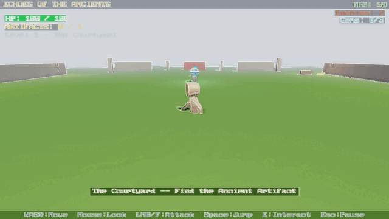
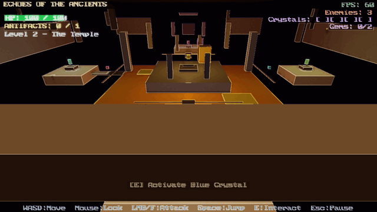
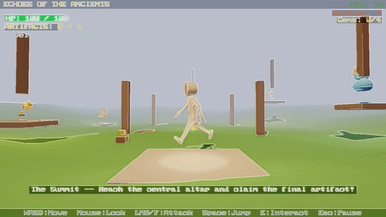
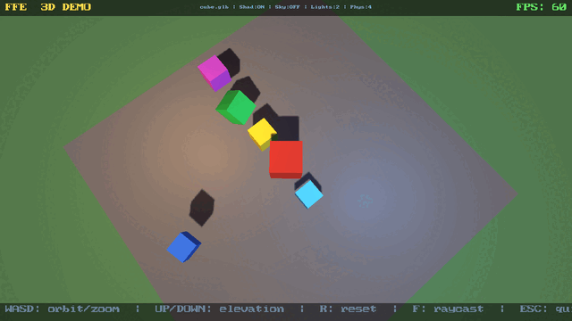
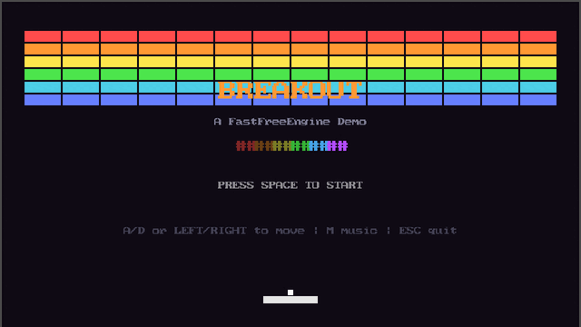

# FastFreeEngine

**Performance-first open-source C++ game engine for older hardware.**

[](LICENSE)
[](https://github.com/Nige-L/FastFreeEngine/actions)

FastFreeEngine (FFE) is a complete game development platform — engine, editor, networking, scripting, and AI-native documentation — built so that anyone can make games, regardless of their hardware budget. It targets hardware from 2012 and guarantees 60 fps on the default LEGACY tier. MIT licensed, forever.

---

## Demos

| | |
|---|---|
|  |  |
| *The Courtyard* — outdoor RPG level (terrain, vegetation, water, SSAO) | *The Temple* — indoor RPG level (shadow mapping, PBR materials) |
|  |  |
| *The Summit* — platforming level (fog, skybox, GPU instancing) | *3D Physics Demo* — Jolt physics, point lights, materials |
|  |  |
| *Feature Showcase* — renderer stress test | *Pong* — classic 2D, pure Lua |
|  | |
| *Breakout* — brick-breaker clone, pure Lua | |

---

## Features

### Rendering
- **2D + 3D** on OpenGL 3.3 (LEGACY tier — runs on 2012-era GPUs)
- **PBR materials** — Cook-Torrance BRDF, image-based lighting (IBL)
- **Skeletal animation** — GPU skinning, crossfade blending, root motion, STEP/LINEAR/CUBIC_SPLINE interpolation
- **Shadow mapping** — PCF 3x3 soft shadows
- **Post-processing** — HDR bloom, ACES tone mapping, SSAO (32-sample hemisphere), FXAA 3.11
- **GPU instancing** — automatic batching by mesh, 1024 instances/batch, instanced shadow pass
- **Skybox** — cubemap environment mapping
- **Sprite batching 2.0** — runtime texture atlas with shelf packing
- **Text rendering** — bitmap 8x8 + TTF (stb_truetype, 8 font slots)
- **Vulkan backend** — compile-time `FFE_BACKEND` switch, VMA memory, SPIR-V pipeline

### World / Environment
- **Terrain system** — heightmap rendering (raw float + PNG), RGBA splat-map texturing, triplanar projection, 3-level LOD, frustum culling, background world streaming
- **Vegetation** — GPU-instanced grass (24 B/instance) and tree placement (16 B/instance)
- **Water surfaces** — reflection FBO, Fresnel blend, animated UV scroll

### Engine
- **EnTT ECS** — entity-component-system core
- **Jolt Physics** — 3D rigid bodies, collision shapes, raycasting
- **Custom 2D collision** — AABB + circle, fast and allocation-free
- **LuaJIT scripting** — sandboxed, ~225 `ffe.*` bindings across all subsystems
- **Client-server networking** — UDP, snapshot interpolation, client-side prediction, lag compensation
- **Positional audio** — miniaudio backend, 3D spatial audio
- **Scene serialisation** — JSON save/load, entity count limits, NaN rejection
- **Prefab system** — JSON prefab definitions, ECS instantiation, per-instance overrides

### Editor (standalone application)
- Scene hierarchy, inspector, viewport gizmos, undo/redo, asset browser, play-in-editor
- **Visual scripting** — node graph editor (ImGui canvas, bezier wires, 11 built-in nodes, topological sort)
- **LLM Integration Panel** — context-aware AI queries using `.context.md` files, Lua snippet insertion

### AI-Native Documentation
Every subsystem ships a `.context.md` file so any AI assistant generates correct FFE code immediately — no hallucinated APIs, no wrong signatures.

---

## Hardware Tiers

| Tier | Era | GPU API | Min VRAM | Default |
|------|-----|---------|----------|---------|
| RETRO | ~2005 | OpenGL 2.1 | 512 MB | |
| **LEGACY** | ~2012 | OpenGL 3.3 | 1 GB | **YES** |
| STANDARD | ~2016 | OpenGL 4.5 / Vulkan | 2 GB | |
| MODERN | ~2022 | Vulkan | 4 GB+ | |

No feature may silently degrade performance on a lower tier. A feature that cannot sustain 60 fps on its declared minimum tier does not ship.

---

## Quick Start

```bash
# Prerequisites: Clang-18 or GCC-13, CMake, Ninja, mold, vcpkg
# Full dependency list: https://nige-l.github.io/FastFreeEngine/

git clone https://github.com/Nige-L/FastFreeEngine.git
cd FastFreeEngine

# Build (Clang-18, LEGACY tier)
cmake -B build -G Ninja \
    -DCMAKE_CXX_COMPILER=clang++-18 \
    -DCMAKE_BUILD_TYPE=Debug \
    -DFFE_TIER=LEGACY
cmake --build build

# Run tests (1579 passing)
ctest --test-dir build --output-on-failure --parallel $(nproc)

# Run the showcase game
./build/examples/showcase/ffe_showcase
```

### Build Matrix

| Target | Command |
|--------|---------|
| Linux / Clang-18 | `cmake -B build -G Ninja -DCMAKE_CXX_COMPILER=clang++-18` |
| Linux / GCC-13 | `cmake -B build-gcc -G Ninja -DCMAKE_CXX_COMPILER=g++-13` |
| Windows / MinGW cross | `cmake -B build-mingw -G Ninja -DCMAKE_TOOLCHAIN_FILE=cmake/toolchains/mingw-w64-x86_64.cmake` |

Platforms: Linux (primary, CI on Clang-18 + GCC-13), Windows (MinGW cross-compile). macOS paused (upstream LuaJIT arm64-osx vcpkg issue).

---

## Project Status

| | |
|---|---|
| Tests | **1579 passing** |
| Lua bindings | **~225** |
| Demo games | 6 |
| Phases complete | 9 of 10 (Phase 10 in progress) |

---

## Links

- **Documentation** — [nige-l.github.io/FastFreeEngine](https://nige-l.github.io/FastFreeEngine/)
- **Roadmap** — [docs/ROADMAP.md](docs/ROADMAP.md)
- **Dev Log** — [docs/devlog.md](docs/devlog.md)
- **Contributing** — [CONTRIBUTING.md](CONTRIBUTING.md)
- **License** — [MIT](LICENSE)
