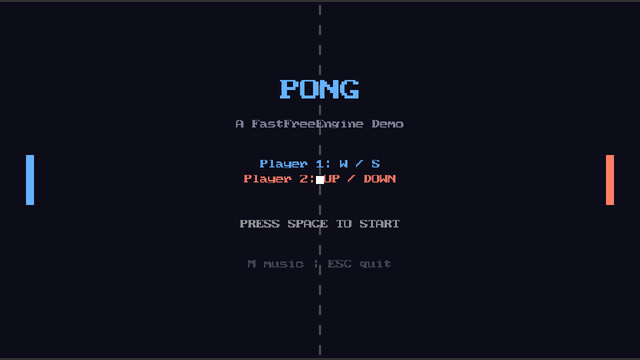

# Pong

Classic two-player Pong. First to five points wins.



## What It Demonstrates

- **Input handling:** Two independent players on the same keyboard using `isKeyHeld`
- **Entity lifecycle:** Paddles, ball, center-line dashes, wall indicators, and goal flash
  panels created at startup; no dynamic allocation during gameplay
- **Collision detection:** AABB paddle/ball collision with angle-based reflection — hit
  position on the paddle changes the outgoing ball angle (up to ±60°)
- **Visual juice:** Ball trail (6-entity fixed pool), speed-based color shift on the ball,
  per-paddle flash on hit, goal flash panels, pulsing serve indicator, camera shake on score
- **Audio:** Background music (OGG), three SFX (paddle hit, wall bounce, score); press M to
  toggle music at runtime
- **HUD:** Score display with large glyphs, status bar, win screen, all drawn with the 2D
  draw API

## Controls

| Key | Action |
|-----|--------|
| W / S | Player 1 (left paddle) up / down |
| Up / Down | Player 2 (right paddle) up / down |
| Space | Serve (or restart after game over) |
| M | Toggle background music |
| ESC | Quit |

Press Space on the title screen to start. First to 5 points wins. Ball speed increases by
25 units per rally hit up to a maximum of 800 units/second.

## How to Run

```sh
./build/examples/pong/ffe_pong
```

Assets are loaded from the shared `assets/` directory at the repository root. Required:
`textures/white.png`. Optional audio: `audio/sfx_pong_paddle.wav`, `audio/sfx_pong_wall.wav`,
`audio/sfx_pong_score.wav`, `audio/music_pixelcrown.ogg`. The demo runs without audio if
files are missing.

## Tier

LEGACY (OpenGL 3.3). 2D only — no 3D or post-processing.
