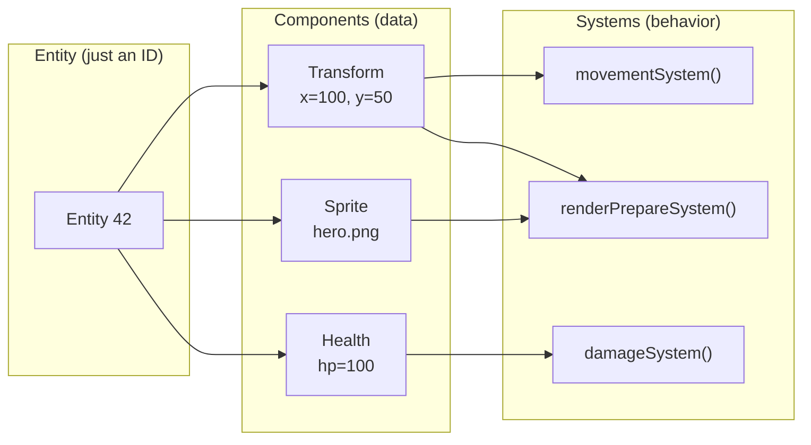
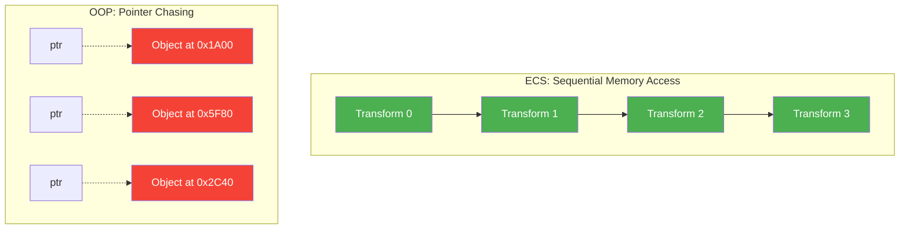

# How the Entity Component System Works

Every game has *stuff* in it -- players, enemies, bullets, trees, health bars, particle effects. A game engine needs a way to organize all that stuff so the computer can process it efficiently. FastFreeEngine uses an **Entity Component System** (ECS) to do this. This page explains what an ECS is, why it exists, and how FFE's implementation works under the hood.

---

## The Problem: Why Not Just Use Classes?

If you have learned object-oriented programming, your first instinct might be to model a game like this:

```
class GameObject {
    virtual void update(float dt) = 0;
    virtual void render() = 0;
};

class Player : public GameObject { ... };
class Enemy  : public GameObject { ... };
class Bullet : public GameObject { ... };
```

This feels natural, but it breaks down fast in a real game engine. Here is why.

### The Diamond of Death

Suppose you have a `FlyingEnemy` and a `SwimmingEnemy`. Both inherit from `Enemy`. Now you want a `FlyingSwimmingEnemy`. Do you inherit from both? That is *multiple inheritance*, and it creates ambiguity -- which `Enemy::update()` gets called? C++ can technically do this, but it leads to fragile, hard-to-debug code.

### The Blob Problem

To avoid multiple inheritance, you start cramming everything into the base class:

```
class GameObject {
    float x, y;           // every object has position
    float health;         // ...but trees do not have health
    Texture* sprite;      // ...but invisible triggers have no sprite
    float damage;         // ...but health pickups do not deal damage
    AIBehavior* ai;       // ...but the player is not AI-controlled
};
```

Now every object carries data it does not use. A tree wastes memory on `health` and `damage`. An invisible trigger wastes memory on `sprite`. This is called a *blob object* -- one class that tries to be everything.

### The Performance Wall

When you have 10,000 objects in a `std::vector<GameObject*>`, updating them means chasing pointers all over memory. Each `virtual void update()` call forces the CPU to look up a vtable, jump to a different function, and load a different chunk of memory. Modern CPUs are fast at sequential access but terrible at random access. Pointer-chasing is one of the worst things you can do for performance.

!!! tip "The takeaway"
    Object-oriented hierarchies work fine for small programs. But when you have thousands of objects that need to run at 60 frames per second on old hardware, you need a different approach.

---

## Entities, Components, and Systems

An ECS splits the world into three concepts:

### Entities

An entity is just a number -- an ID. It has no data and no behavior on its own. Think of it like a row number in a spreadsheet.

```
Entity 0:  (the player)
Entity 1:  (an enemy)
Entity 2:  (a bullet)
Entity 3:  (a tree)
```

That is it. An entity is not a class, not a struct, not an object. It is an integer.

### Components

A component is a plain chunk of data attached to an entity. Think of components as *columns* in a spreadsheet.

| Entity | Transform | Sprite | Health | Collider | AI |
|--------|-----------|--------|--------|----------|----|
| 0 (player) | x=100, y=50 | hero.png | 100 | box | -- |
| 1 (enemy) | x=300, y=50 | goblin.png | 30 | box | patrol |
| 2 (bullet) | x=150, y=50 | bullet.png | -- | circle | -- |
| 3 (tree) | x=400, y=80 | tree.png | -- | -- | -- |

Notice: not every entity has every component. The bullet has no Health. The tree has no Collider or AI. Components are mix-and-match. You compose an entity by choosing which data to attach.

In FFE, components are simple C++ structs with no inheritance and no virtual functions:

```cpp
struct Transform {
    glm::vec3 position = {0, 0, 0};
    glm::vec3 scale    = {1, 1, 1};
    float     rotation = 0.0f;
};

struct Sprite {
    rhi::TextureHandle texture = {0};
    glm::vec2 size;
    glm::vec4 color = {1, 1, 1, 1};
    // ...
};
```

### Systems

A system is a function that processes all entities that have a specific set of components. Systems contain the *behavior*. Components contain the *data*.

```cpp
// This system moves everything that has both a Transform and a Velocity.
void movementSystem(World& world, float dt) {
    auto view = world.view<Transform, const Velocity>();
    for (auto entity : view) {
        auto& pos = view.get<Transform>(entity);
        const auto& vel = view.get<const Velocity>(entity);
        pos.position.x += vel.dx * dt;
        pos.position.y += vel.dy * dt;
    }
}
```

The movement system does not care whether an entity is a player, an enemy, or a bullet. If it has `Transform` and `Velocity`, it moves. This is the power of ECS: behavior emerges from data composition, not class hierarchies.



---

## How FFE's ECS Works

FFE's ECS is built on top of **EnTT**, a widely used open-source ECS library for C++. EnTT handles the low-level storage and iteration. FFE wraps it in a `World` class that provides a clean API and integrates with the rest of the engine.

### The World

The `World` class is your entry point to the ECS. It owns the entity registry and the list of registered systems.

```cpp
// Create an entity
ffe::EntityId player = world.createEntity();

// Attach components
world.addComponent<Transform>(player, glm::vec3{100.0f, 50.0f, 0.0f});
world.addComponent<Sprite>(player);

// Query components
auto& sprite = world.getComponent<Sprite>(player);
sprite.size = {32.0f, 32.0f};

// Destroy an entity (removes all its components)
world.destroyEntity(player);
```

### Entity IDs

An `EntityId` in FFE is a 32-bit integer. The upper 12 bits store a *generation counter* and the lower 20 bits store an *index*. This means:

- Up to ~1 million entities can exist simultaneously (20 bits = 1,048,576 slots)
- When an entity is destroyed and its slot is reused, the generation increments
- If you hold a stale ID from a destroyed entity, `world.isValid(id)` returns `false` because the generation does not match

This prevents a common bug: using an ID that *used to* refer to a player but now refers to a completely different entity because the slot was recycled.

### Views: Querying the ECS

When a system needs to find all entities with certain components, it creates a *view*:

```cpp
auto view = world.view<Transform, Sprite>();
for (auto entity : view) {
    auto& transform = view.get<Transform>(entity);
    auto& sprite    = view.get<Sprite>(entity);
    // ... do something with them
}
```

A view does not copy anything. It walks directly over the component storage arrays, visiting only entities that have *all* the requested components. This is extremely fast -- typically a tight loop over contiguous memory.

### Systems Are Just Functions

In some ECS implementations, systems are classes with inheritance. FFE keeps it simpler: a system is a plain function pointer.

```cpp
using SystemUpdateFn = void(*)(World& world, float dt);
```

You register systems with a name (for logging) and a priority (lower runs first):

```cpp
world.registerSystem(FFE_SYSTEM("Movement", movementSystem, 100));
world.registerSystem(FFE_SYSTEM("Physics",  physicsSystem,  200));
world.registerSystem(FFE_SYSTEM("Render",   renderPrepare,  500));
world.sortSystems();
```

Every frame, the engine calls each system in priority order. No virtual functions, no allocations, no overhead -- just a list of function pointers called in sequence.

!!! info "Priority ranges"
    | Range | Purpose |
    |-------|---------|
    | 0-99 | Input polling |
    | 100-199 | Gameplay and scripting |
    | 200-299 | Physics |
    | 300-399 | Animation |
    | 400-499 | Audio |
    | 500+ | Render preparation |

### Context Singletons

Some data is global to the entire scene rather than per-entity. Examples: the camera, the background color, the lighting configuration. FFE stores these as *context variables* in the ECS registry:

```cpp
// Set the background color (stored once, not per-entity)
auto& clearColor = world.registry().ctx().get<ffe::ClearColor>();
clearColor.r = 0.1f;
clearColor.g = 0.1f;
clearColor.b = 0.2f;
```

Context singletons avoid the need for global variables while keeping the data accessible to any system that needs it.

---

## Memory Layout: Why This Is Fast

This is where ECS really shines compared to object-oriented designs. It all comes down to how memory works.

### Cache Lines: A 30-Second Primer

Your CPU does not read memory one byte at a time. It reads in chunks called *cache lines*, typically 64 bytes. When you access a variable, the CPU loads the entire 64-byte block surrounding it into a fast local cache. If the next variable you need is in that same block, the access is nearly instant ("cache hit"). If it is somewhere else in memory, the CPU has to go fetch another block ("cache miss"), which is 100-200x slower.

### Arrays Beat Linked Lists

In an ECS, all components of the same type are stored in a contiguous array:

```
Transform array:  [T0][T1][T2][T3][T4][T5][T6][T7] ...
                   ^^^^^^^^^^^^^^^^^^^^^^^^^^^^^^^^
                   All packed together in memory
```

When `movementSystem` iterates over all `Transform` components, it walks straight through this array. The CPU prefetcher recognizes the pattern and loads the next cache line before you even ask for it. This is called *sequential access*, and modern CPUs are incredibly good at it.

Compare this to the object-oriented approach:

```
GameObject* objects[8]:
  [ptr]--> Player at 0x1A00
  [ptr]--> Enemy  at 0x5F80
  [ptr]--> Bullet at 0x2C40
  [ptr]--> Tree   at 0x8100
  ...
  Each object is scattered across the heap
```

Every pointer dereference is a potential cache miss. With 10,000 objects, the difference is dramatic.



!!! example "Real numbers"
    On LEGACY-tier hardware (~2012), iterating 10,000 `Transform` components in a contiguous array takes about 0.01 ms. Iterating 10,000 scattered `GameObject*` pointers with virtual dispatch takes 0.5-2 ms. That is a 50-200x difference -- enough to make or break 60 fps.

### Why FFE Uses Function Pointers Instead of Virtual Functions

Virtual functions require a *vtable lookup*: the CPU reads a hidden pointer in the object, follows it to a table of function addresses, then jumps to the right function. This is three memory accesses instead of one, and the branch predictor cannot predict which function will be called because it depends on the object's runtime type.

FFE systems are plain function pointers stored in a flat array. The CPU knows exactly where each function is, and the branch predictor handles it easily. This is a small but measurable win when systems run 60 times per second.

---

## Creating Your Own Components

Adding a new component type to FFE is straightforward. A component is any plain struct:

```cpp
// In your game code or a new engine header:
struct Health {
    float current = 100.0f;
    float maximum = 100.0f;
};

struct Velocity {
    float dx = 0.0f;
    float dy = 0.0f;
};
```

Use it just like built-in components:

```cpp
auto id = world.createEntity();
world.addComponent<Transform>(id, glm::vec3{0, 0, 0});
world.addComponent<Health>(id);
world.addComponent<Velocity>(id, 50.0f, 0.0f);
```

Write a system to operate on it:

```cpp
void healthRegenSystem(ffe::World& world, float dt) {
    auto view = world.view<Health>();
    for (auto entity : view) {
        auto& hp = view.get<Health>(entity);
        if (hp.current < hp.maximum) {
            hp.current = std::min(hp.current + 5.0f * dt, hp.maximum);
        }
    }
}

world.registerSystem(FFE_SYSTEM("HealthRegen", healthRegenSystem, 150));
```

!!! tip "Keep components small"
    Components should contain only data, not behavior. Keep them small (under 64 bytes if possible) so multiple components fit in a single cache line. If you need a component with a large payload (like `ParticleEmitter` with its 128-particle inline pool), that is fine -- just be aware of the memory cost.

### Rules for Components

1. **Plain data only.** No virtual functions, no inheritance, no `std::function`. Components are plain structs (POD or close to it).
2. **No heap allocations in components.** Use fixed-size arrays or handles (integer IDs) instead of pointers. The `ParticleEmitter` uses a fixed array of 128 particles, not a `std::vector`.
3. **No cross-references.** A component should not store a pointer to another component or entity. Store an `EntityId` instead and look it up through the `World`.

---

## Thought Experiment: What If We Used Inheritance?

Let us walk through a concrete example to see why ECS wins.

**The game:** A top-down 2D shooter with players, enemies, bullets, health pickups, and destructible walls.

### With inheritance:

```
GameObject
  +-- MovableObject (has velocity)
  |     +-- Character (has health)
  |     |     +-- Player (has input)
  |     |     +-- Enemy (has AI)
  |     +-- Bullet (has damage)
  +-- StaticObject
        +-- Wall (has health, destructible)
        +-- HealthPickup (has heal amount)
```

Problems:
- `Wall` has health but is not a `Character`. Do you duplicate the health logic?
- `HealthPickup` needs to move (float up and down). But it inherits from `StaticObject`. Do you refactor the entire hierarchy?
- You want enemies that can pick up health. Now `Enemy` needs healing behavior from `HealthPickup`. Multiple inheritance?
- Every change to the hierarchy risks breaking something else.

### With ECS:

| Entity | Transform | Velocity | Health | Input | AI | Damage | Destructible | HealAmount |
|--------|-----------|----------|--------|-------|-----|--------|-------------|------------|
| Player | yes | yes | yes | yes | -- | -- | -- | -- |
| Enemy | yes | yes | yes | -- | yes | -- | -- | -- |
| Bullet | yes | yes | -- | -- | -- | 10 | -- | -- |
| Wall | yes | -- | yes | -- | -- | -- | yes | -- |
| Pickup | yes | yes | -- | -- | -- | -- | -- | 25 |

Want the pickup to float? Just add `Velocity`. Want the enemy to heal? Add `HealAmount`. Want a destructible bullet-sponge? Add both `Health` and `Destructible`. No hierarchy changes. No refactoring. No diamond of death.

The ECS approach scales because adding new behavior means defining a new component and a new system -- not restructuring an inheritance tree.

---

## FFE's ECS at a Glance

| Concept | FFE Implementation |
|---------|-------------------|
| Entity | 32-bit ID (12-bit generation + 20-bit index) |
| Component | Plain C++ struct, stored in contiguous arrays by EnTT |
| System | Function pointer: `void(*)(World&, float)` |
| Query | `world.view<A, B, C>()` -- returns entities with all listed components |
| Singleton | ECS context variable: `world.registry().ctx().get<T>()` |
| Storage | EnTT sparse set -- O(1) add/remove, O(n) iteration |
| Allocation | No per-frame heap allocation. Arena allocator for temporary data |

---

## Further Reading

- [Core API Reference](../api/core.md) -- full `World` API, all component types, system registration
- [How the Renderer Works](renderer.md) -- how `renderPrepareSystem` turns ECS data into pixels
- [How Multiplayer Networking Works](networking.md) -- how the ECS replicates over the network
