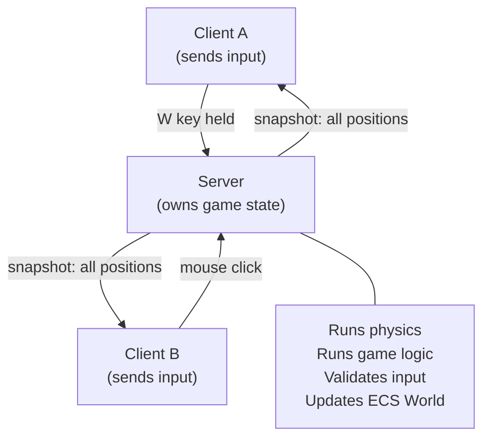
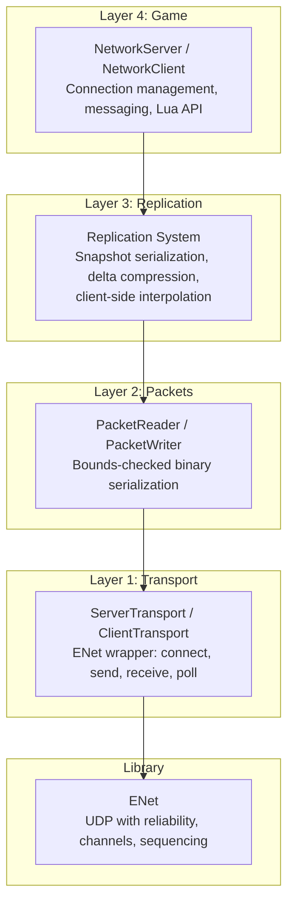
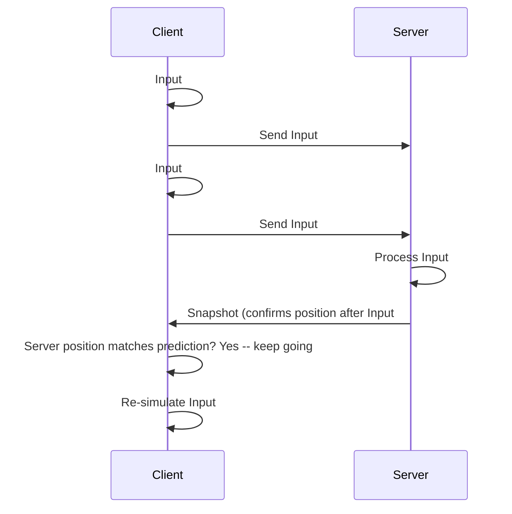

# How Multiplayer Networking Works

Making a single-player game feel smooth is hard enough. Making a multiplayer game feel smooth when players are separated by hundreds of milliseconds of network latency is one of the hardest problems in game development. This page explains how FastFreeEngine's networking stack works, from raw UDP packets to client-side prediction.

---

## The Problem: Networks Are Unreliable and Slow

When you press a button in a single-player game, the response is instant -- your character moves on the very next frame, within 16 milliseconds. In a multiplayer game, that button press has to travel across the internet to a server, get processed, and the result has to travel back. A round trip from London to New York takes about 70 ms. From Tokyo to Sao Paulo, it can exceed 250 ms.

On top of latency, the internet is unreliable:

- **Packets get lost.** UDP does not guarantee delivery. Roughly 1-5% of packets on a typical connection just vanish.
- **Packets arrive out of order.** Packet A might be sent before Packet B but arrive after it.
- **Packets get duplicated.** Routers sometimes send the same packet twice.
- **Bandwidth is limited.** Sending too much data chokes the connection and makes everything worse.

A networking system has to handle all of this while making the game feel responsive to every player simultaneously.

!!! info "Why not TCP?"
    TCP guarantees delivery and ordering, so why not use it? Because TCP achieves this through *retransmission* and *head-of-line blocking*. If packet 5 is lost, TCP holds packets 6, 7, and 8 hostage until packet 5 is resent and received. In a fast-paced game, you would rather skip the old data and use the newest update. Games need UDP with a selective reliability layer on top -- exactly what FFE uses.

---

## Client-Server Architecture

### Why Authoritative Servers Matter

FFE uses an **authoritative server** model. The server is the single source of truth for the game state. Clients are display terminals that show what the server tells them.



**The server:**

- Owns the canonical ECS `World`
- Runs physics and game logic every tick
- Receives player input and validates it before applying it
- Broadcasts the resulting game state to all clients

**Each client:**

- Sends its player's input (key presses, mouse movements) to the server
- Receives state snapshots from the server
- Renders the game based on those snapshots
- Does *not* run authoritative game logic

### Why Not Let Every Client Be Equal?

This is called *peer-to-peer*, and it has a fatal flaw: any client can lie. If Client A says "I have 999 health and I teleported behind you," there is no authority to say otherwise. In a client-server model, the server validates everything:

```
Client says: "I moved 500 units this frame"
Server checks: "Max speed is 10 units per frame. Rejected."
```

Cheating is not eliminated (the client can still aim-bot on their local display), but the server prevents any player from modifying the game state in ways that affect other players.

### Listen Server vs. Dedicated Server

FFE supports both modes:

| Mode | How It Works | Good For |
|------|-------------|----------|
| **Listen server** | One player's machine runs both the server and a client. Other players connect to them. | Casual games, LAN parties, small groups |
| **Dedicated server** | A separate headless process runs server logic only -- no window, no renderer, no audio. | Competitive games, large player counts |

The headless dedicated server skips all rendering initialization. It still ticks the ECS, physics, and networking every frame -- it just does not draw anything.

---

## The Network Stack

FFE's networking is built in layers, from low-level transport up to high-level game concepts:



### Layer 1: Transport (ENet)

FFE uses **ENet** as its transport library. ENet is a thin, battle-tested C library (20+ years old, used in dozens of shipped games) that adds reliability on top of UDP.

ENet provides:

- **Channels** with configurable delivery: reliable ordered, unreliable sequenced, etc.
- **Connection management** with handshake, keep-alive, and timeout detection
- **Fragmentation** for packets larger than the network MTU
- **Bandwidth throttling** to prevent flooding

FFE wraps ENet in `ServerTransport` and `ClientTransport` classes that expose a simple send/receive API.

### Layer 2: Packets

All network data is serialized into a binary format. No JSON, no text, no XML -- binary is compact and fast to parse.

```
Packet layout (6-byte header):
  [type: 1 byte]           -- what kind of packet this is
  [channel: 1 byte]        -- which delivery channel (0-2)
  [sequence: 2 bytes]      -- application-level sequence number
  [payload_length: 2 bytes]  -- how many bytes follow
  [payload: N bytes]       -- the actual data
```

Deserialization uses a `PacketReader` that **bounds-checks every read**:

```cpp
PacketReader reader(data, dataSize);

uint8_t type;
if (!reader.readU8(type)) return;      // Packet too short -- abort

uint16_t entityCount;
if (!reader.readU16(entityCount)) return;  // Not enough data -- abort

// Every read is safe. No buffer overrun is possible.
```

If any read would go past the end of the packet, it returns `false` and the packet is dropped. This is a hard security requirement -- network packets are *untrusted external input*.

### Layer 3: Replication

Replication is the process of synchronizing the server's ECS state with every connected client. Not all components need to cross the network -- particle effects, for instance, are purely visual and can run independently on each client.

FFE explicitly registers which component types replicate:

| Replicated | Not Replicated |
|-----------|----------------|
| `Transform` (2D position) | `ParticleEmitter` (client-side VFX) |
| `Transform3D` (3D position) | `Collider2D` (server-side only) |
| `Sprite` (visual state) | `SpriteAnimation` (client-side playback) |
| `Mesh` (3D model reference) | |
| `Material3D` (material properties) | |

### Layer 4: Game

The top layer provides the API that game code (Lua scripts) actually uses:

```lua
-- Start hosting a game on port 7777
ffe.startServer(7777)

-- Or connect to someone else's game
ffe.connectToServer("192.168.1.42", 7777)

-- Send a chat message
ffe.sendMessage("chat", "Hello world!")

-- Handle incoming messages
ffe.onNetworkMessage(function(senderId, channel, data)
    ffe.log("Player " .. senderId .. " says: " .. data)
end)
```

---

## Snapshot Replication

Every 50 milliseconds (20 times per second by default), the server takes a *snapshot* of the game state and sends it to each client.

### Full Snapshots

When a client first connects, it receives a **full snapshot** -- a complete dump of every replicated entity and component:

```
Full Snapshot:
  [tick_number: 4 bytes]
  [baseline_tick: 4 bytes]   -- 0 for a full snapshot
  [entity_count: 2 bytes]
  For each entity:
    [entity_id: 4 bytes]
    [component_mask: 2 bytes]  -- bitfield: which components are present
    For each component:
      [component_data: ...]    -- serialized by registered function
```

### Delta Snapshots

After the initial full snapshot, the server only sends **deltas** -- what changed since the last snapshot the client acknowledged. If only 3 out of 100 entities moved, only those 3 are included.

Change detection is simple: each replicated component has a `dirty` flag. When a system modifies a component, the flag is set. The replication system reads and clears these flags each network tick.

!!! example "Bandwidth savings"
    Consider a game with 100 entities, each with a `Transform` (12 bytes of position data). A full snapshot is roughly 100 x 16 bytes = 1,600 bytes. If only 5 entities moved this tick, the delta is 5 x 16 = 80 bytes. That is a 20x reduction in bandwidth, and it keeps packets well under the 1,200-byte MTU target.

### The Network Tick Rate

The network tick rate is separate from the render frame rate:

| Rate | Default | Purpose |
|------|---------|---------|
| Network tick | 20 Hz | How often the server sends snapshots |
| Render frame | 60+ Hz | How often the screen is redrawn |

Sending state 20 times per second is enough for most games. Higher rates (up to 60 Hz) are available for fast-paced competitive games, at the cost of more bandwidth.

---

## Client-Side Interpolation

The client renders at 60 fps but receives state updates at 20 Hz. Without interpolation, entities would visibly "teleport" between positions 50 ms apart. Interpolation smooths this out.

The client maintains a buffer of recent snapshots (the last 8-16). Instead of rendering the *latest* snapshot, it renders one network tick *behind* real time:

```
Server snapshots:  T0 ---- T1 ---- T2 ---- T3 ---- T4
                         |                     |
Client renders:    ^^^^^^^^^^^^^^^^^^^^^^^^^^^
                   Interpolating between T1 and T2
                   while T3 and T4 are buffered ahead
```

For each render frame, the client computes a fractional position between two bracketing snapshots:

```
render_time = current_time - interpolation_delay

fraction = (render_time - T1_time) / (T2_time - T1_time)

entity.position = lerp(T1.position, T2.position, fraction)
entity.rotation = slerp(T1.rotation, T2.rotation, fraction)
```

`lerp` (linear interpolation) blends positions smoothly. `slerp` (spherical linear interpolation) blends rotations without gimbal lock artifacts.

!!! tip "The cost of smoothness"
    Interpolation adds one network tick of visual latency (50 ms at 20 Hz). The player sees the game state as it was 50 ms ago. For cooperative games and most action games, this is imperceptible. For competitive shooters, client-side prediction reduces this perceived latency.

---

## Client-Side Prediction

In a pure interpolation model, pressing "move right" has a visible delay: the input goes to the server, the server moves the character, the snapshot comes back, and *then* the client shows the movement. At 100 ms round-trip, this feels sluggish.

Client-side prediction fixes this by simulating the player's own movement locally, *before* the server confirms it.

### How It Works

1. **The client records each input** with a sequence number: "Input #47: move right at tick 120"
2. **The client simulates the input locally**, so the player character moves immediately
3. **The input is sent to the server**, which processes it and includes the result in the next snapshot
4. **When the server's snapshot arrives**, the client checks: "The server says I am at position X after processing input #47"
5. **If the client's prediction matches**, great -- nothing to correct
6. **If there is a mismatch**, the client snaps to the server's position and *re-simulates* all inputs that the server has not yet acknowledged



### Server Reconciliation

When the server's confirmed position differs from the client's predicted position, the client must *reconcile*. This means:

1. Accept the server's position as ground truth
2. Re-apply all unconfirmed inputs (inputs the server has not acknowledged yet)
3. The result is the new predicted position

If the re-simulated position is close to the old prediction, the correction is invisible to the player. If it is far off (because the server rejected an input or physics diverged), the player sees a small "rubber-band" snap. Minimizing these corrections is an art.

---

## Lag Compensation

Prediction makes *your own* movement feel instant. But what about shooting at other players? You see their position as it was 50+ ms ago (interpolation delay + network latency). If you aim at where you *see* them and fire, by the time the server processes your shot, they have already moved.

**Lag compensation** solves this. When the server receives a shot from a client, it:

1. Notes the client's estimated latency (say, 80 ms)
2. **Rewinds** the game state to where entities were 80 ms ago
3. Performs the hit check against the historical positions
4. If the shot hit in the rewound state, it counts as a hit

This means players can aim at what they see and expect hits to register, even with significant latency. The trade-off: occasionally, a player might be hit even though *they* thought they were behind cover -- because from the shooter's perspective (80 ms ago), they were not.

FFE exposes lag compensation through Lua:

```lua
-- Set the maximum rewind window (in seconds)
ffe.setLagCompensationWindow(0.2)  -- 200 ms max rewind

-- Perform a hit check with lag compensation
ffe.performHitCheck(shooterEntity, targetX, targetY, radius)

-- Get notified of confirmed hits
ffe.onHitConfirm(function(shooterId, targetId)
    ffe.log("Hit confirmed!")
end)
```

---

## The Lobby System

Before the game starts, players need a way to gather, choose settings, and signal readiness. FFE provides a lobby system for this pre-game phase.

```lua
-- Host creates a lobby
ffe.createLobby()

-- Other players join
ffe.joinLobby()

-- Each player signals ready
ffe.setReady(true)

-- Query lobby state
local players = ffe.getLobbyPlayers()
for _, p in ipairs(players) do
    ffe.log("Player " .. p.id .. " ready: " .. tostring(p.ready))
end

-- Host starts the game when everyone is ready
ffe.startLobbyGame()

-- Callbacks
ffe.onLobbyUpdate(function(players)
    -- Update lobby UI
end)

ffe.onGameStart(function()
    -- Transition to gameplay
end)
```

The lobby runs on the same connection as the game -- no separate matchmaking server is needed for LAN or small-group play.

---

## Security: Every Packet Is Untrusted

Network code is a primary attack surface. Every byte that arrives over the network could be malicious -- sent by a cheater, a fuzzer, or a broken client. FFE enforces strict security at every layer.

### Threat Mitigations

| Threat | Mitigation |
|--------|------------|
| Malformed packets | `PacketReader` bounds-checks every read. Unknown types are dropped. |
| Oversized packets | Maximum 1,200 bytes enforced before parsing. Excess is dropped. |
| Packet flooding | Per-connection rate limit: max 100 packets/second, max 64 KB/second. Exceeding the limit disconnects the peer. |
| Integer overflow | All size calculations use `uint32_t` with explicit overflow checks. |
| Unbounded allocation | No heap allocation driven by packet data. Pre-allocated fixed-size buffers only. |
| State manipulation | Clients send only input, never state. Server validates all input (speed limits, legal actions). |
| Connection exhaustion | Max 32 clients (configurable). New connections beyond the limit are rejected. |
| Zombie connections | 10-second timeout for inactive connections. |

### The Five Security Invariants

These rules are non-negotiable in FFE's networking code:

1. **No packet can cause a heap allocation whose size comes from packet data.**
2. **No packet can cause a read or write beyond a buffer boundary.**
3. **No client packet can directly modify server-side game state** -- only input is accepted.
4. **No connection can consume more than its rate-limited share of server resources.**
5. **No packet type is processed without first validating the packet length.**

!!! tip "NaN and Inf rejection"
    All floating-point values read from packets are checked for NaN (Not a Number) and Infinity. A malicious client could send NaN as a position value, which would propagate through physics calculations and corrupt the entire game state. FFE rejects these values at the packet parsing layer.

---

## Thought Experiment: What If Every Client Trusted Every Other Client?

This is the peer-to-peer (P2P) model: all clients are equal, and each one broadcasts its state to all others.

**The cheating problem:** In P2P, any client can claim anything. "My health is 99999." "I teleported to the flag." "The ball went in your goal." There is no authority to validate or reject these claims. Online games built on P2P trust are trivially exploitable.

**The scaling problem:** With N clients, each one needs to communicate with every other. That is N*(N-1)/2 connections. 8 players means 28 connections. 32 players means 496 connections. A client-server model has N connections -- one per client to the server.

**The desync problem:** If every client runs its own simulation, tiny floating-point differences between platforms (Linux vs. Windows, AMD vs. Intel) cause the simulations to diverge over time. Without a central authority to correct drift, the players end up seeing different game states. Debugging these desyncs is notoriously difficult.

The authoritative server model avoids all three problems. It is the industry standard for online multiplayer, used by virtually every competitive game from Counter-Strike to Fortnite.

---

## Performance Budget

Networking is CPU work, not GPU work. Here is what it costs:

| Operation | Time | Frequency |
|-----------|------|-----------|
| ENet poll (receive all pending packets) | ~0.01 ms | Once per frame |
| Snapshot serialization (100 entities) | ~0.1 ms | Once per network tick (20 Hz) |
| Snapshot deserialization (client) | ~0.05 ms | Once per network tick |
| Interpolation (100 entities) | ~0.02 ms | Once per render frame |
| Rate limit checks | ~0.001 ms | Per packet |

**Total per frame: under 0.5 ms.** This is less than 3% of the 16.6 ms frame budget at 60 fps, even on LEGACY hardware. Networking adds negligible overhead.

Memory usage is similarly modest:

| Allocation | Size |
|------------|------|
| ENet host | ~2 KB |
| Per-peer state (32 peers max) | ~32 KB total |
| Snapshot buffer (16 slots) | ~256 KB |
| Packet buffers | ~2.4 KB (stack/arena) |
| **Total** | **< 512 KB** |

---

## The Channel System

FFE uses three ENet channels, each with different delivery guarantees:

| Channel | Delivery | Used For |
|---------|----------|----------|
| 0 | Reliable, ordered | Connection handshake, game events, RPC |
| 1 | Unreliable, sequenced | Snapshots (newer replaces older -- if an old snapshot arrives late, it is discarded) |
| 2 | Reliable, ordered | Player input (must arrive, must be in order) |

Why separate channels? Because they have different requirements:

- **Snapshots** (channel 1) are unreliable because a late snapshot is worthless -- a newer one has already arrived. Retransmitting it wastes bandwidth.
- **Input** (channel 2) is reliable because every input must be processed. If input #47 is lost, the server cannot process input #48 correctly (it depends on the prior state).
- **Events** (channel 0) are reliable because game events (player joined, player scored, game over) must not be lost.

---

## Further Reading

- [Networking API Reference](../api/networking.md) -- full Lua API, all connection and messaging functions
- [How the ECS Works](ecs.md) -- the entity/component model that networking replicates
- [How the Renderer Works](renderer.md) -- how replicated state turns into pixels on each client
