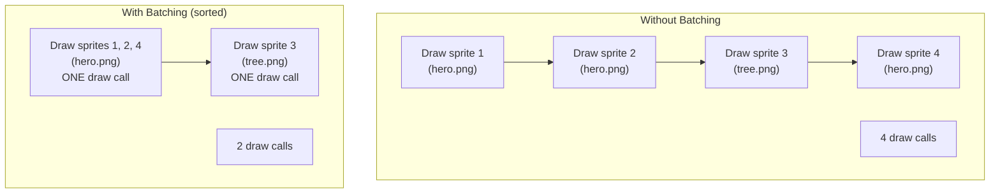
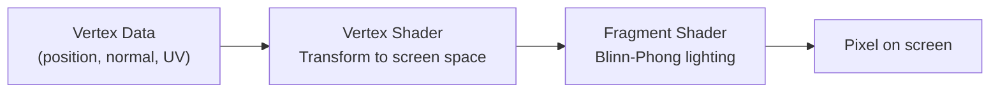
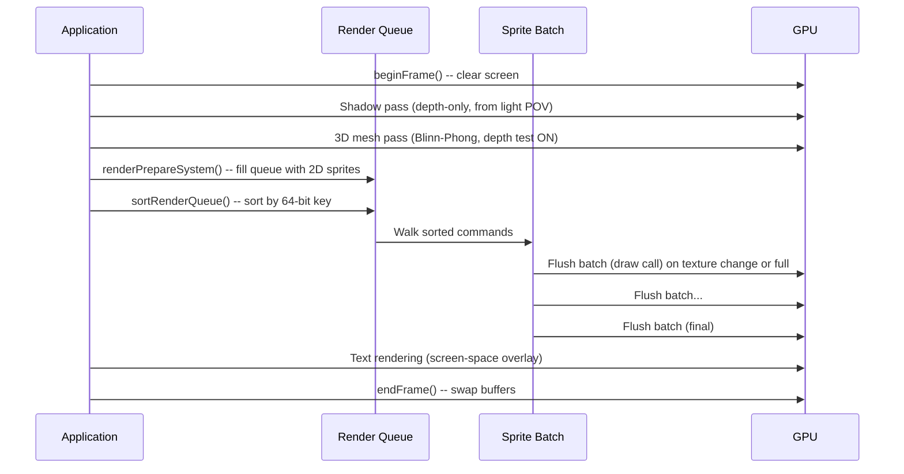

# How the Renderer Works

The renderer's job sounds simple: get pixels on the screen. In practice, it is one of the most performance-critical parts of any game engine. FastFreeEngine's renderer is designed to run well on hardware from 2012 -- a GPU with 1 GB of VRAM and OpenGL 3.3 support. This page explains how it turns your entities into a finished frame, from clearing the screen to swapping the buffers.

---

## The Problem: Drawing Is Expensive

A modern game might have 5,000 sprites on screen. The naive approach -- "for each sprite, tell the GPU to draw it" -- means 5,000 individual *draw calls*. Each draw call has overhead: the CPU has to set up state, the driver has to validate it, and the GPU has to start a new batch of work. On old hardware, draw call overhead alone can eat your entire frame budget.

The goal is to get the same visual result with far fewer draw calls. FFE does this through **sorting** and **batching**.

!!! info "The frame budget"
    At 60 frames per second, you have 16.6 milliseconds to do *everything* -- process input, run game logic, simulate physics, and render the frame. The renderer typically gets 4-8 ms of that budget on LEGACY hardware. Every draw call you eliminate is time you get back.

---

## The Render Pipeline

Every frame follows the same sequence:


### Step 1: Clear

The renderer clears the screen to the background color. This is a single OpenGL call (`glClear`) that resets both the color buffer and the depth buffer.

```cpp
rhi::beginFrame({0.1f, 0.1f, 0.2f, 1.0f}); // Dark blue background
```

### Step 2: Shadow Pass

If shadows are enabled, a *depth-only* pass renders the scene from the light's perspective into a shadow map texture. This must run before the 3D pass so that the shadow map is available for the lighting shader to sample.

### Step 3: 3D Pass

If any entities have `Transform3D` + `Mesh` components, the 3D render pass runs next. Depth testing is enabled so that closer objects obscure farther ones. Each 3D mesh is drawn with the Blinn-Phong lighting shader, which samples the shadow map generated in Step 2 to determine which fragments are in shadow.

### Step 4: 2D Sort

The `renderPrepareSystem` reads every entity with `Transform` + `Sprite` and writes a `DrawCommand` into the **render queue**. Each command is tagged with a 64-bit *sort key* that encodes the draw order. The render queue is then sorted by this key.

### Step 5: 2D Batch

The sorted commands are fed to the **sprite batch**. The batcher walks through the sorted commands and groups consecutive sprites that share the same texture into a single draw call. Instead of 5,000 draw calls, you might end up with 20-50.

### Step 6: Text

Bitmap and TrueType text are rendered on top of everything in screen space.

### Step 7: Present

The finished frame is presented by swapping the front and back buffers (`glfwSwapBuffers`). If VSync is enabled (the default), this call blocks until the monitor is ready for a new frame.

---

## 2D Sprite Batching

Batching is the single most important optimization in a 2D renderer. Here is how it works.

### The Sort Key

Every sprite gets a 64-bit sort key that determines its draw order:

```
Bit layout (64 bits total):
[Layer: 4 bits][Shader: 4 bits][Texture: 16 bits][Depth: 24 bits][SubOrder: 16 bits]
```

| Field | Bits | Purpose |
|-------|------|---------|
| Layer | 4 | Render layer (0-15). Background = 0, UI = 15 |
| Shader | 4 | Which shader program to use |
| Texture | 16 | Which texture is bound (same texture = same batch) |
| Depth | 24 | Z-depth for ordering within a layer |
| SubOrder | 16 | Fine-grained ordering within everything else |

Sorting by this key achieves two things at once:

1. **Correct draw order.** Sprites on layer 10 always draw after layer 5.
2. **Minimal state changes.** Within the same layer, sprites using the same texture are adjacent after sorting. The batcher can draw them all in one call.

!!! tip "Why texture matters for batching"
    Changing the bound texture on the GPU is one of the most expensive state changes. By sorting sprites so that all sprites using `hero.png` are adjacent, the batcher can draw them all without a texture switch. This is why texture atlases (one big image containing many small sprites) are so valuable -- everything uses the same texture, so everything batches together.

### How the Batcher Works

The sprite batch maintains a CPU-side vertex buffer that it fills up as it processes sorted commands:

```
For each sorted DrawCommand:
    If the texture changed OR the batch is full (2048 sprites):
        Flush the current batch to the GPU (one draw call)
        Start a new batch with the new texture
    Add 4 vertices (a quad) to the CPU buffer
After all commands:
    Flush the remaining batch
```

Each sprite is a quad made of 4 vertices and 6 indices (two triangles). The batch can hold up to **2,048 sprites** (8,192 vertices) before it must flush. When it flushes, it uploads the vertex data to the GPU and issues a single `glDrawElements` call.



### The Vertex Format

Each sprite vertex is 32 bytes:

| Field | Type | Size | Description |
|-------|------|------|-------------|
| x, y | float | 8B | Screen position |
| u, v | float | 8B | Texture coordinate |
| r, g, b, a | float | 16B | Color tint |

Four vertices per sprite, six indices per sprite (two triangles sharing two vertices). The index buffer is static -- it never changes, because the triangle topology is the same for every quad.

### Render Queue Capacity

The render queue is a flat, pre-allocated array of `DrawCommand` structs. No dynamic allocation happens during rendering.

| Tier | Max Draw Commands |
|------|-------------------|
| LEGACY | 8,192 |
| STANDARD | 32,768 |
| MODERN | 131,072 |

If the queue fills up, additional sprites are silently dropped. This is a safety valve, not normal operation -- if you are hitting the limit, your scene is too complex for the target tier.

---

## 3D Mesh Rendering

FFE supports 3D alongside 2D. The 3D pass runs before the 2D pass each frame, with depth testing enabled. After the 3D pass completes, depth testing is disabled and the 2D sprites render on top.

### Loading Meshes

3D models are loaded from **binary glTF 2.0** (`.glb`) files. FFE uses the `cgltf` library to parse the file format, then uploads the vertex and index data to the GPU.

Each mesh vertex is 32 bytes:

| Field | Type | Size | Description |
|-------|------|------|-------------|
| px, py, pz | float | 12B | Position |
| nx, ny, nz | float | 12B | Surface normal (for lighting) |
| u, v | float | 8B | Texture coordinate |

Limits are enforced to prevent loading absurdly large models:

| Limit | Value |
|-------|-------|
| Max file size | 64 MB |
| Max vertices per mesh | 1,000,000 |
| Max indices per mesh | 3,000,000 |
| Max loaded meshes | 100 |

### Blinn-Phong Shading

FFE uses the **Blinn-Phong** lighting model for 3D meshes. This is a classic lighting technique that has been used in games since the 1990s. It is cheap to compute and looks good enough for most games.

The model has three components that are added together for each pixel:

```
Final color = Ambient + Diffuse + Specular
```

**Ambient** is a constant base color so that nothing is completely black. Even surfaces facing away from the light get some color.

**Diffuse** depends on the angle between the surface normal and the light direction. Surfaces facing the light are bright; surfaces facing away are dark. This is computed with a dot product:

```
diffuse = max(dot(normal, lightDir), 0.0) * lightColor
```

**Specular** creates shiny highlights. It depends on the angle between the reflected light direction and the viewer's eye. The "Blinn" part uses a *halfway vector* (between the light and the eye) as an optimization over the original Phong reflection calculation.



FFE supports:
- **One directional light** (like the sun) -- always active
- **Up to 8 point lights** -- local lights with distance falloff
- **Diffuse textures** -- color maps applied to mesh surfaces
- **Normal maps** -- fake surface detail without extra geometry
- **Specular maps** -- control shininess per-pixel

### Shadow Mapping

Shadows use a two-pass technique called *shadow mapping*:

1. **Shadow pass:** Render the entire scene from the light's viewpoint into a depth-only texture (the "shadow map"). This records how far each pixel is from the light.
2. **Main pass:** When rendering each fragment, transform its position into light-space and compare its depth to the shadow map. If the fragment is farther from the light than the shadow map value, it is in shadow.

This is a well-understood technique that works on OpenGL 3.3 hardware. FFE provides Lua bindings to enable/disable shadows and configure bias and area:

```lua
ffe.enableShadows()
ffe.setShadowBias(0.005)
ffe.setShadowArea(30.0)
```

### Skeletal Animation

FFE supports skeletal animation for 3D models. A skeleton is a hierarchy of *bones*, each with a transform relative to its parent. An animation stores keyframes (position, rotation, scale) for each bone at specific timestamps.

Each frame:

1. The animation system samples keyframes for the current playback time
2. It walks the bone hierarchy to compute world-space transforms
3. Each bone's world transform is multiplied by its *inverse bind matrix* (the matrix that "unbinds" the bone from its rest pose)
4. The resulting bone matrices are uploaded to the GPU as a uniform array
5. The skinned mesh shader applies bone matrices to each vertex based on bone weights

FFE supports up to **64 bones** per skeleton. The skinned mesh shader (`MESH_SKINNED`) and its shadow variant (`SHADOW_DEPTH_SKINNED`) handle bone matrix multiplication in the vertex shader.

---

## OpenGL 3.3: Why This API Level

FFE targets **OpenGL 3.3 Core Profile** as its rendering API. This is a deliberate choice.

### What OpenGL 3.3 Gives Us

- **Shaders (GLSL 330 core):** Programmable vertex and fragment shaders
- **Vertex Array Objects (VAOs):** Efficient vertex attribute binding
- **Framebuffer Objects (FBOs):** Off-screen rendering for shadow maps
- **Texture units:** Multiple textures bound simultaneously (for shadow maps, normal maps, etc.)
- **Instanced rendering:** Drawing many copies of the same mesh efficiently

### What It Does NOT Give Us

- **Compute shaders** (requires OpenGL 4.3)
- **Tessellation** (requires OpenGL 4.0)
- **Multi-draw indirect** (requires OpenGL 4.3)
- **Bindless textures** (requires OpenGL 4.4 + extensions)

These are nice features, but they require newer hardware. A laptop from 2012 with an Intel HD 4000 GPU supports OpenGL 3.3 but not 4.x. By targeting 3.3, FFE runs on that hardware.

!!! info "The LEGACY tier"
    FFE's default hardware tier is LEGACY (~2012 era). OpenGL 3.3 is the API for this tier. Higher tiers (STANDARD, MODERN) will gain access to OpenGL 4.5 and Vulkan features in the future, but the LEGACY path will always remain as the baseline.

### The Render Hardware Interface (RHI)

FFE does not call OpenGL functions directly from game code. Instead, it uses a **Render Hardware Interface** -- a thin abstraction layer that wraps GPU operations in platform-independent functions:

```cpp
// Instead of raw OpenGL:
//   GLuint tex; glGenTextures(1, &tex); glBindTexture(GL_TEXTURE_2D, tex); ...

// FFE uses the RHI:
rhi::TextureHandle tex = rhi::createTexture(desc);
rhi::bindTexture(tex, 0);  // Bind to texture unit 0
```

Today, the only RHI backend is OpenGL 3.3. In the future, a Vulkan backend can be added behind the same interface. Game code and engine systems never call `gl*` functions -- they go through the RHI.

---

## The Shader Library

FFE ships with **8 built-in shaders** that cover common rendering needs. All shaders are written in GLSL 330 core and compiled at engine startup.

| Shader | Purpose |
|--------|---------|
| `SOLID` | Solid-color geometry (debug rectangles, wireframes) |
| `TEXTURED` | Basic textured meshes |
| `SPRITE` | 2D sprite batching with per-vertex color tint |
| `MESH_BLINN_PHONG` | 3D meshes with directional + point light shading |
| `SHADOW_DEPTH` | Depth-only pass for shadow map generation |
| `SKYBOX` | Cubemap environment rendering |
| `MESH_SKINNED` | 3D meshes with skeletal animation (bone matrices) |
| `SHADOW_DEPTH_SKINNED` | Shadow map generation for skinned meshes |

Shader source code is stored as string literals in `shader_library.cpp`, not as external `.glsl` files. This simplifies distribution (no loose shader files to lose) and ensures the shaders are always available.

You can also create custom shaders:

```cpp
rhi::ShaderDesc desc;
desc.vertexSource   = myVertexGLSL;
desc.fragmentSource = myFragmentGLSL;
desc.debugName      = "custom_water";

rhi::ShaderHandle waterShader = rhi::createShader(desc);
```

---

## Thought Experiment: What If Every Sprite Had Its Own Draw Call?

Let us do the math for a typical 2D game on LEGACY hardware.

**Scene:** 3,000 sprites on screen -- a busy top-down RPG with terrain tiles, characters, items, and particle effects.

**Without batching:**

- 3,000 draw calls
- Each draw call has ~5 microseconds of CPU overhead (driver validation, state setup)
- 3,000 x 5 us = **15 ms** just in draw call overhead
- That is nearly the entire 16.6 ms frame budget -- no time left for game logic

**With FFE's batching (assume 10 unique textures):**

- Sprites sorted by texture, then drawn in batches of up to 2,048
- Roughly 10-15 draw calls (one per texture, maybe a few batch flushes)
- 15 x 5 us = **0.075 ms** of draw call overhead
- That is 200x less CPU time, leaving plenty of room for everything else

This is why sorting and batching matter. The GPU is not the bottleneck on old hardware -- the CPU-to-GPU communication is. Reducing draw calls is the single most impactful optimization for 2D rendering.

!!! example "A practical tip"
    Use texture atlases. If all your sprites are packed into one or two atlas textures, the batcher can draw your entire scene in 1-2 draw calls. This is why tools like TexturePacker exist -- they are not just for convenience, they are a performance tool.

---

## The Full Frame in Summary



Every step is designed to minimize GPU state changes and avoid CPU-side allocations. The render queue is pre-allocated. The vertex staging buffer is pre-allocated. The index buffer is static. No `new`, no `malloc`, no `push_back` in the hot path.

---

## Further Reading

- [Renderer API Reference](../api/renderer.md) -- full RHI API, component types, shader uniforms
- [How the ECS Works](ecs.md) -- the data model behind `Transform`, `Sprite`, and `Mesh` components
- [How Multiplayer Networking Works](networking.md) -- how game state replicates across the network
